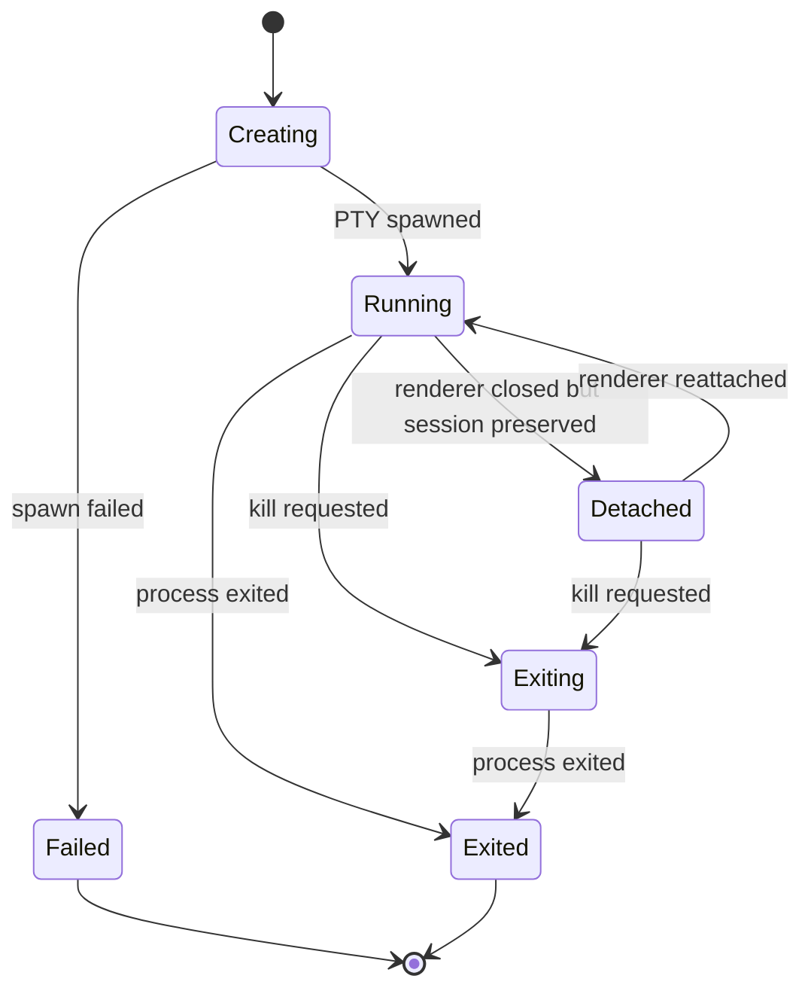

# Terminal Session Manager

## Status

Accepted component architecture.

## Purpose

The terminal session manager is the central domain service. It owns canonical terminal lifecycle state and coordinates PTY, policy, recorder, renderer, and agent-facing behavior.

This component is part of the [Terminal Architecture Spec](../terminal-architecture.md).

## Responsibilities

- Create, track, and dispose terminal sessions.
- Assign stable session IDs.
- Track lifecycle state.
- Own canonical session metadata: shell, cwd, env profile, cols, rows, title, createdBy, and timestamps.
- Route input to the correct PTY.
- Broadcast output, exit, resize, title, bell, and error events.
- Enforce policy decisions before sensitive operations.
- Notify recorder and observation systems.
- Provide query APIs for session state.
- Provide a bounded shutdown operation that terminates active PTYs before clearing session records.

## State Machine

## Boundaries

The session manager must not:

- Import renderer UI.
- Import Electron windows directly.
- Expose raw `node-pty` handles.
- Implement transport-specific agent gateway behavior.
- Store app diagnostics as PTY output.

## Session Metadata

Session metadata must be serializable and shared through protocol types. At minimum, it should include:

- Session ID.
- Lifecycle state.
- Shell executable and shell profile.
- Working directory.
- Environment profile identity, not necessarily full environment values.
- Rows and columns.
- Title.
- Creation origin.
- Created, updated, and exited timestamps.
- Exit code and signal when available.

## Testing Expectations

- Session lifecycle transitions follow the state machine.
- PTY output, exit, title, bell, resize, and error events are broadcast through public event contracts.
- A failing event subscriber must not prevent other subscribers from receiving events or change session lifecycle state.
- Shutdown terminates running or exiting sessions without leaving orphaned PTY handles.
- Shutdown must not clear still-active session records when termination fails or times out; keeping the PTY handle available lets callers retry, inspect, or escalate cleanup.
- Policy denials stop sensitive operations before PTY writes or lifecycle changes.
- Recorder events are emitted in stable order.
- Query APIs return snapshots without exposing mutable internal state.
