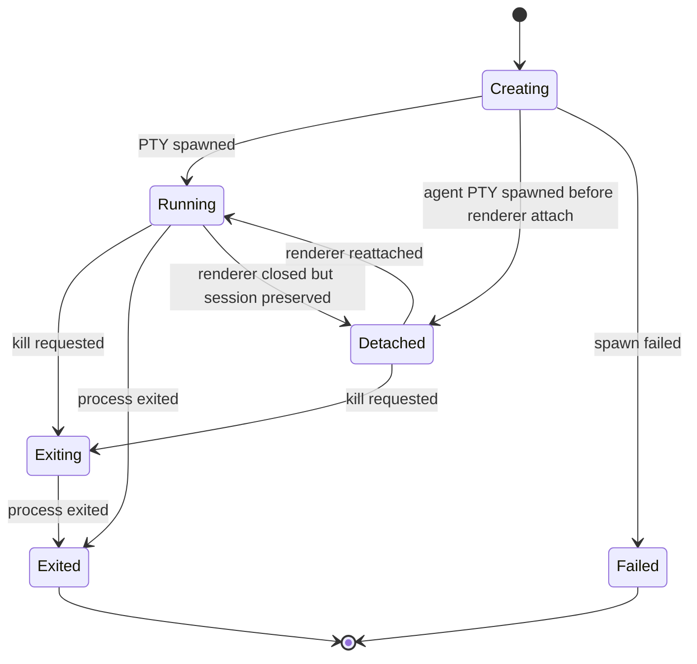

# Terminal Session Manager

## Status

Accepted component architecture.

## Purpose

The terminal session manager is the central domain service. It owns canonical
terminal lifecycle state and coordinates PTY, recorder, renderer, and
agent-facing behavior. Trusted main-process callers authorize sensitive
requests through the policy engine before invoking session-manager side-effect
methods.

This component is part of the [Terminal Architecture Spec](../terminal-architecture.md).

## Responsibilities

- Create, track, and dispose terminal sessions.
- Release exited or failed session records when no renderer view needs them.
- Assign stable session IDs.
- Track lifecycle state.
- Own canonical session metadata: shell, cwd, env profile, cols, rows, title, createdBy, and timestamps.
- Apply the main-process default working directory only when a create request
  does not carry explicit or profile-derived `cwd` launch metadata.
- Route input to the correct PTY.
- Broadcast output, exit, resize, title, bell, and error events.
- Preserve stable side-effect boundaries so policy-enforcing callers can deny
  sensitive operations before PTY, lifecycle, or recorder mutation.
- Notify recorder and observation systems.
- Provide query APIs for session state.
- Provide a bounded shutdown operation that terminates active PTYs before clearing session records.

## State Machine

Agent-created sessions enter `Detached` after PTY spawn until a renderer view
attaches. Detached sessions still have a live PTY and accept input, resize,
observation, and kill operations through the public session APIs.
If the last renderer owner for a live session is destroyed or its render
process is lost, main requests a detach transition instead of leaving the
session marked `Running` without an observable renderer owner.

`session.error` is a diagnostic event, not a lifecycle transition by itself.
Only canonical snapshots and explicit lifecycle events change session state. A
recording failure or observer failure can emit `session.error` while the PTY
continues running and accepting input, resize, detach, and kill operations.
Session creation failures still transition the session record to `failed`.

Renderer-discovered title and bell notifications are reported back to the
session manager through typed IPC. Title updates change canonical session
metadata and emit `session.title`; bell notifications emit `session.bell`.
App diagnostics may log that these events occurred, but must not log
shell-provided title text by default.

## Boundaries

The session manager must not:

- Import renderer UI.
- Import Electron windows directly.
- Expose raw `node-pty` handles.
- Implement transport-specific agent gateway behavior.
- Store app diagnostics as PTY output.

## Session Metadata

Session metadata must be serializable and shared through protocol types. At minimum, it should include:

- Session ID.
- Lifecycle state.
- Shell executable and shell profile.
- Working directory.
- Environment profile identity, not necessarily full environment values.
- Rows and columns.
- Title.
- Creation origin.
- Created, updated, and exited timestamps.
- Exit code and signal when available.

## Working Directory Defaults

Create-session requests preserve caller intent. An explicit `cwd` from the
renderer, agent API, or shell profile is passed through unchanged and should
fail as a structured PTY spawn error if the directory is invalid for the host
platform.

When no `cwd` is provided, the desktop main process supplies a validated native
terminal default working directory. The default is the user's home directory,
not the Electron process working directory, because packaged apps launched by
the OS may start with `/` or another launch-service directory that native
terminal users do not expect. If the OS home directory cannot be resolved, main
falls back through platform environment home variables and finally the current
process directory only as a last-resort availability fallback.

## Testing Expectations

- Session lifecycle transitions follow the state machine.
- PTY output, exit, title, bell, resize, and error events are broadcast through public event contracts.
- `session.error` diagnostics do not make a running session failed unless the canonical lifecycle state changes.
- A failing event subscriber must not prevent other subscribers from receiving events or change session lifecycle state.
- Shutdown terminates running or exiting sessions without leaving orphaned PTY handles.
- Shutdown must not clear still-active session records when termination fails or times out; keeping the PTY handle available lets callers retry, inspect, or escalate cleanup.
- Releasing a session is distinct from killing it. Only exited and failed sessions can be released; running or exiting sessions must first be explicitly terminated or allowed to exit.
- After a kill request is accepted, new writes, key input, paste, mouse input,
  resize, and interrupt operations must fail while the session is `exiting`,
  `exited`, or `failed`. Recent output remains readable until the session
  record is released. A second kill request may be accepted while the session is
  still `exiting` so callers can retry termination if the process does not exit
  promptly.
- Policy-enforcing callers stop sensitive operations before PTY writes,
  lifecycle changes, or recorder control/export side effects.
- Recorder events are emitted in stable order.
- Query APIs return snapshots without exposing mutable internal state.
