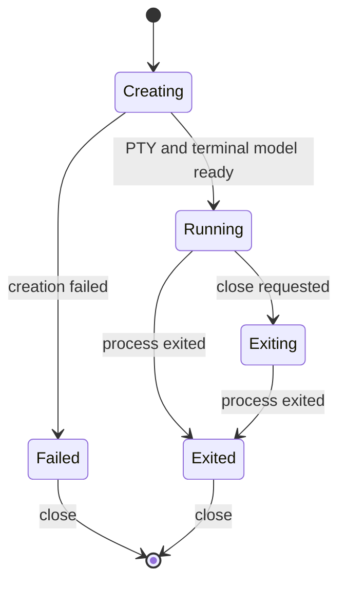

# Terminal Session Manager

## Status

Accepted component architecture.

## Purpose

The terminal session manager owns PTY-backed session lifecycle and canonical
terminal state. Presentation and agent attachment are separate concerns.

## Responsibilities

- Create and identify PTY-backed sessions.
- Create both persistent interactive-shell sessions and temporary command
  sessions from explicit launch requests.
- Resolve shell, working directory, environment, and dimensions.
- Own the PTY handle and one canonical terminal model per session.
- Serialize output, input, resize, scroll, lifecycle, and recording changes.
- Return protocol responses generated by the canonical terminal model directly
  to the PTY without classifying or recording them as human or agent input.
- Publish one ordered returned-or-failed outcome per generated response so
  renderer projections can correlate partial PTY write failures without
  reordering query occurrences.
- Provide session summaries and versioned observations.
- Finalize output before exit.
- Close sessions with bounded termination and recording finalization.
- Shut down active sessions without discarding handles that fail to terminate.
- Optionally retain a bounded combined raw-output tail for temporary command
  result construction.

## Lifecycle

Lifecycle states are `creating`, `running`, `exiting`, `exited`, and `failed`.
The existence of a renderer view never changes lifecycle.

Temporary command sessions use the same lifecycle and canonical model as
persistent sessions. Their process launch exits after the supplied shell input,
and their final exit is observable only after queued output has settled.

## Close

Closing an active session requests PTY termination and waits for a bounded
period. Successful exit is committed after pending output settles. Active
recording is finalized before the record is released. If termination times out,
the record and PTY handle remain available. If recording finalization fails,
the exited record remains available for retry.

## Boundaries

The session manager must not import Electron windows, renderer code, WebSocket
transport, or agent connection ownership. It exposes no node-pty handles.

## Testing Expectations

- Lifecycle follows the state machine.
- Headless sessions support input, resize, scroll, observe, and close.
- Output order and final exit state are deterministic.
- Terminal device queries supported by the canonical parser are answered once
  from canonical state in headless and presented sessions.
- A failed response write emits a typed input failure and remains positionally
  represented in renderer output metadata so only that query can fall back to
  the projection response.
- Temporary command output is settled before the operation manager observes
  completion.
- Failing subscribers do not corrupt session state.
- Recording failures are surfaced without silently discarding records.
- Shutdown does not orphan or forget active PTYs.
