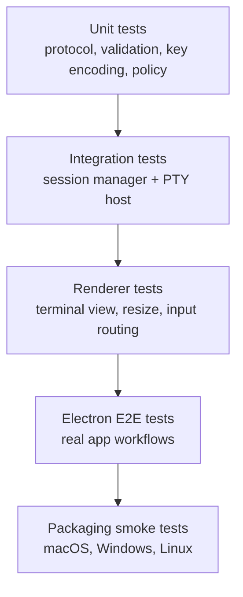

# Implementation and Testing Plan

## Status

Accepted baseline plan.

## Purpose

This document defines the implementation sequence and testing plan for the terminal architecture. The system design source of truth remains the [Terminal Architecture Spec](./terminal-architecture.md); this plan describes how to build and verify that architecture incrementally.

## Planning Principles

- Build the plain terminal foundation before agent-specific features.
- Keep every phase shippable enough to validate real terminal behavior.
- Add tests before implementation code for new features and bug fixes.
- Test observable behavior through public package, IPC, renderer, or agent APIs.
- Avoid fixed sleeps in async tests; use events, retrying assertions, polling helpers with timeouts, or stream reads.
- Keep native PTY behavior isolated and covered at the public session/protocol boundary.

## Test Layers



## Required Coverage Areas

- Session lifecycle.
- Shell resolution.
- PTY spawn failure.
- Input write.
- Resize propagation.
- Exit events.
- IPC request/response validation.
- Agent authorization and denial.
- Screen snapshot shape.
- Alternate-screen behavior.
- Recording event order.
- Settings migration.
- App restart and session cleanup behavior.

## Phase 1: Plain Terminal Foundation

Goal: create a reliable single-session terminal with real PTY behavior and a secure Electron process split.

Implementation:

- Scaffold the TypeScript workspace.
- Create the Electron app with secure main, preload, and renderer separation.
- Add the shared protocol package for session IDs, requests, events, and errors.
- Add xterm.js terminal view.
- Add node-pty PTY host.
- Add shell resolver for the current platform.
- Add session manager for one session.
- Add typed IPC for create, output, write, resize, kill, and exit.
- Add persisted versioned settings for shell, font, theme, and scrollback.
- Add bounded app shutdown that terminates active sessions in Phase 1.
- Add persistent structured app logging with JSONL file output, development
  stderr mirroring, redaction, rotation, and lifecycle/session/IPC failure
  events.

Testing:

- Unit tests for protocol types, validation, and domain errors.
- Unit tests for logger formatting, level filtering, redaction, truncation,
  file append, rotation, sink fallback, and memory capture.
- Integration tests for session lifecycle, PTY input/output, resize, and exit events.
- Renderer tests for terminal view creation, output rendering, input forwarding, and resize reporting.
- Electron smoke test that creates a terminal, runs a simple command, and observes output.

Exit criteria:

- A user can open the app and interact with a real shell.
- `Ctrl+C`, Enter, paste, resize, and process exit work through the app surface.
- Terminal output, app logs, and errors remain separate.
- App logs persist under Electron's logs path and never include PTY bytes,
  terminal input, clipboard contents, transcript data, or full environment
  values by default.
- Renderer IPC failures return typed terminal errors instead of raw thrown values.

## Phase 2: Multi-session Human Terminal

Goal: make the app useful as a human terminal with multiple sessions and expected desktop terminal workflows.

Implementation:

- Add tabs and panes.
- Add shell profiles.
- Add copy, paste, search, links, title, bell, and status UI.
- Add window/session restore policy.
- Add renderer-driven screen snapshots.
- Add settings persistence and migrations.

Testing:

- Unit tests for shell profile resolution and settings migration.
- Integration tests for multiple session lifecycle behavior.
- Renderer tests for tab, pane, focus, copy, paste, search, title, and bell behavior.
- Electron E2E tests for creating, switching, resizing, closing, detaching, and restoring sessions.

Exit criteria:

- Multiple sessions can run independently.
- Closing a view is distinct from terminating a session.
- Settings and window state restore safely after restart.

## Phase 3: Agent Control Plane

Goal: expose terminal control to local authenticated agents without bypassing the real terminal/session path.

Implementation:

- Add local agent gateway.
- Add short-lived authentication.
- Add policy engine decision points.
- Add agent commands for create, attach, send text, send key, resize, read output, capture screen, wait, and kill.
- Add audit events.
- Add visible agent activity indicators.

Testing:

- Unit tests for agent protocol validation and policy decisions.
- Integration tests for gateway authentication, command handling, denial paths, and event streaming.
- E2E tests showing agent input and human input operate the same PTY session.
- Regression tests for unauthorized access and malformed messages.

Exit criteria:

- A local authenticated agent can create and operate a terminal through the gateway.
- Unauthorized or denied operations produce structured errors without side effects.
- Agent activity is visible and auditable.

## Phase 4: TUI and Observation Hardening

Goal: make terminal observation and input robust enough for curses-style apps, pagers, editors, and test watchers.

Implementation:

- Add robust key encoder.
- Add mouse event support.
- Add alternate-screen snapshot support.
- Add prompt detection helpers.
- Add `waitForText`, `waitForPrompt`, `waitForScreenChange`, and `waitForQuiet`.
- Add deterministic TUI fixtures.

Testing:

- Unit tests for key encoding, wait conditions, and snapshot normalization.
- Integration tests for alternate screen, mouse mode forwarding, and prompt/wait helpers.
- E2E tests against deterministic TUI-like fixtures.
- Timeout tests for every wait helper.

Exit criteria:

- Agents can observe normal-buffer and alternate-screen state.
- Wait helpers resolve on matching state and fail predictably on timeout.
- Common TUI navigation works through keyboard and mouse primitives.

## Phase 5: Recording, Replay, and Packaging

Goal: add replayable session records, redaction controls, diagnostics, and platform-specific distributable builds.

Implementation:

- Add transcript recorder.
- Add replay metadata and export.
- Add redaction and recording policy.
- Add app log viewer or export path.
- Add cross-platform packaging.
- Add release CI and provenance.

Testing:

- Unit tests for recording event schema, redaction, and migrations.
- Integration tests for recording event order across create, input, output, resize, and exit.
- Replay validation tests for exported session files.
- Packaging smoke tests on macOS, Windows, and Linux.
- Release verification that native PTY modules are packaged correctly.

Exit criteria:

- Recording can be enabled, disabled, redacted, exported, and replayed according to policy.
- Packaged app artifacts launch and can create a PTY-backed terminal on each target OS.
- Release artifacts include provenance attestations.

## Release Verification

Before pushing a release branch or publishing artifacts, run the relevant project-defined checks:

- Install dependencies from the lockfile.
- Lint.
- Format check.
- Type check.
- Unit tests.
- Integration tests.
- Electron E2E smoke tests.
- Build desktop artifacts.
- Verify native PTY module packaging.
- Generate provenance attestations.

Once the TypeScript workspace exists, prefer these root scripts when available:

```bash
pnpm lint
pnpm format
pnpm typecheck
pnpm test
pnpm test:e2e
pnpm build
```
