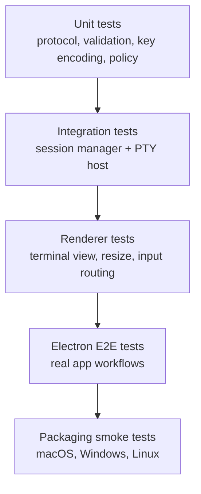

# Implementation and Testing Plan

## Status

Phase 3 external agent control plane implemented and verified locally and in
GitHub Actions on macOS, Windows, and Linux. Phase 4 human terminal UX polish
is intentionally deferred while Phase 5 packaging and release-hardening work
continues.

## Purpose

This document defines the implementation sequence and testing plan for the terminal architecture. The system design source of truth remains the [Terminal Architecture Spec](./terminal-architecture.md); this plan describes how to build and verify that architecture incrementally.

## Planning Principles

- Build the plain terminal foundation before agent-specific features.
- Keep every phase shippable enough to validate real terminal behavior.
- After the plain terminal and tabs baseline, prioritize capabilities that make
  terminal sessions observable, controllable, and durable for agents. Human-only
  terminal conveniences can be added after the agent-useful substrate is solid.
- Preserve the implemented external agent gateway/API contract while later
  phases build human terminal polish and packaging on top of it.
- Add tests before implementation code for new features and bug fixes.
- Test observable behavior through public package, IPC, renderer, or agent APIs.
- Avoid fixed sleeps in async tests; use events, retrying assertions, polling helpers with timeouts, or stream reads.
- Keep native PTY behavior isolated and covered at the public session/protocol boundary.

## Test Layers



## Required Coverage Areas

- Session lifecycle.
- Shell resolution.
- PTY spawn failure.
- Input write.
- Resize propagation.
- Exit events.
- IPC request/response validation.
- Screen snapshot shape.
- Alternate-screen behavior.
- Recording event order.
- Settings migration.
- App restart and session cleanup behavior.
- Agent authorization and denial once the external agent API is designed.

## Phase 1: Plain Terminal Foundation

Goal: create a reliable single-session terminal with real PTY behavior and a secure Electron process split.

Implementation:

- Scaffold the TypeScript workspace.
- Create the Electron app with secure main, preload, and renderer separation.
- Add the shared protocol package for session IDs, requests, events, and errors.
- Add xterm.js terminal view.
- Add node-pty PTY host.
- Add shell resolver for the current platform.
- Add session manager for one session.
- Add typed IPC for create, output, write, resize, kill, and exit.
- Add persisted versioned settings for shell, font, theme, and scrollback.
- Add bounded app shutdown that terminates active sessions in Phase 1.
- Add persistent structured app logging with JSONL file output, development
  stderr mirroring, redaction, rotation, and lifecycle/session/IPC failure
  events.

Testing:

- Unit tests for protocol types, validation, and domain errors.
- Unit tests for logger formatting, level filtering, redaction, truncation,
  file append, rotation, sink fallback, and memory capture.
- Integration tests for session lifecycle, PTY input/output, resize, and exit events.
- Renderer tests for terminal view creation, output rendering, input forwarding, and resize reporting.
- Electron smoke test that creates a terminal, runs a simple command, and observes output.

Exit criteria:

- A user can open the app and interact with a real shell.
- `Ctrl+C`, Enter, paste, resize, and process exit work through the app surface.
- Terminal output, app logs, and errors remain separate.
- App logs persist under Electron's logs path and never include PTY bytes,
  terminal input, clipboard contents, transcript data, or full environment
  values by default.
- Renderer IPC failures return typed terminal errors instead of raw thrown values.

## Phase 2: Tabs Baseline and Agent-Useful Terminal Runtime

Goal: keep the app usable for humans while prioritizing the runtime capabilities
agents need: durable sessions, observable terminal state, faithful input, wait
helpers, and replayable diagnostics. Defer human-only conveniences until the
agent-useful substrate is stable.

Implementation status: the tabs baseline, internal observation contracts, wait
helpers, shared input routing, detach/attach lifecycle, shell launch profiles,
and off-by-default recording/export runtime are implemented. The external agent
gateway/API is intentionally not part of Phase 2.

Phase 2A starts with a tabs-only multi-session milestone. Each tab owns one
real PTY session. Inactive tabs remain mounted so their output and scrollback
continue to update while the user works elsewhere. Restart opens a fresh
default human terminal tab; detached live sessions can still be reconciled into
visible tabs, but prior human tab count, order, active tab, cwd, and shell
metadata are not persisted as restart state. UI theme preference is persisted as
settings state independent of terminal layout.

Implementation:

- Phase 2A: add terminal tabs, tab focus, tab close, running-tab close
  confirmation, shell title labels, and bell/unread indicators.
- Phase 2A: add session release so exited and failed sessions can be removed
  after their final view closes without conflating release with kill.
- Add a screen observer that can snapshot visible rows, cursor position,
  viewport dimensions, title, lifecycle state, and alternate-screen state.
- Add recent-output and visible-viewport observation buffers without mixing them
  with app logs or transcript recording.
- Add wait primitives over observed terminal state: `waitForText`,
  `waitForPrompt`, `waitForScreenChange`, and `waitForQuiet`, each with an
  explicit timeout.
- Add robust key, paste, interrupt, resize, and mouse input routing so future
  agent control can use the same PTY path as human input.
- Add detached and reattachable session behavior so a PTY can outlive a
  renderer view without being confused with a killed session.
- Add shell launch profiles as typed launch metadata for sessions. A human
  profile picker can come later.
- Add transcript recording, redaction policy, replay metadata, and export
  primitives needed for debugging and replaying agent terminal work.
- Defer panes, search UI, clickable links, copy/paste polish, window geometry
  restore, app log viewer, and other human-only UX.

Testing:

- Unit tests for settings migration, shell launch metadata, key encoding, wait
  conditions, snapshot normalization, and recorder event schema.
- Integration tests for multiple session lifecycle behavior, detach/reattach,
  observation buffers, alternate-screen snapshots, mouse forwarding, recording
  event order, redaction, and replay metadata.
- Renderer tests for mounted tabs, focus, title, bell, screen snapshots, and
  snapshot request/response behavior.
- Electron E2E tests for creating, switching, resizing, closing, detaching,
  reattaching, fresh restart behavior, snapshotting normal and alternate
  screens, and wait helper timeouts.

Exit criteria:

- Multiple sessions can run independently.
- Closing a view is distinct from terminating a session.
- Sessions can be detached from and reattached to renderer views.
- Agents can observe normal-buffer and alternate-screen state through internal
  observation contracts.
- Wait helpers resolve on matching state and fail predictably on timeout.
- Common TUI navigation works through keyboard and mouse primitives.
- Recording can be enabled, disabled, redacted, exported, and replayed according
  to policy.
- App restart starts a fresh default human tab while preserving non-layout
  settings safely.

## Phase 3: External Agent Control Plane

Goal: design and expose the local authenticated external API after the internal
terminal observation, lifecycle, input, wait, and recording contracts are proven.

Status: complete. The gateway, policy layer, protocol contracts, descriptor
discovery, audit events, UI activity indicator, and regression coverage are
implemented on the Phase 3 branch and have passed the local verification set and
GitHub Actions matrix on macOS, Windows, and Linux.

Implementation:

- Add a local-only WebSocket agent gateway inside Electron main, bound to
  `127.0.0.1`.
- Write an ephemeral runtime descriptor under Electron `userData` with the
  gateway URL, short-lived token, token expiry, and app PID; remove it on
  shutdown.
- Add short-lived token authentication before terminal commands are accepted.
- Add policy engine decision points for authenticated local agent control and
  session ownership.
- Add agent commands for list, create, attach, send text, send key, resize,
  read output, capture screen, wait, kill, and release.
- Treat renderer-dependent observation honestly: recent output works through
  session-core, while capture-screen and screen-based waits return structured
  observation errors when no renderer window can provide a snapshot.
- Keep agent-created PTY sessions usable in detached/headless mode when a
  renderer window cannot be created, while surfacing display failure as a
  non-fatal structured agent error.
- Add audit events without logging tokens, terminal input, PTY output, or
  transcript data.
- Add visible agent activity indicators.

Testing:

- Unit tests for agent protocol validation and policy decisions.
- Integration tests for gateway authentication, command handling, denial paths, and event streaming.
- E2E tests showing agent input and human input operate the same PTY session.
- Regression tests for unauthorized access and malformed messages.

Exit criteria:

- A local authenticated agent can create and operate a terminal through the gateway.
- Unauthorized or denied operations produce structured errors without side effects.
- Agent activity is visible and auditable.
- The same implementation passes verification on macOS, Windows, and Linux.

## Phase 4: Human Terminal UX Completion

Goal: add the remaining human-facing desktop terminal conveniences after the
agent-useful terminal runtime and external agent API are stable.

Implementation:

- Add panes and split-layout controls.
- Add profile picker and shell profile management UI.
- Add copy, paste, search, clickable links, title, bell, status, and command
  palette polish beyond the tabs baseline.
- Add full window size, position, display, and geometry restore.
- Add app log viewer or diagnostic export UI.

Testing:

- Renderer tests for pane layout, pane focus, pane close, copy, paste, search,
  links, and human profile selection behavior.
- Electron E2E tests for split panes, window restore, search, copy/paste, link
  opening policy, and desktop workflow polish.

Exit criteria:

- Human terminal workflows match expected desktop terminal behavior beyond the
  agent-first baseline.
- Window state restores safely and validates display bounds.
- Human-facing profile and search/link workflows are covered by UI tests.

## Phase 5: Packaging and Release Hardening

Goal: produce platform-specific distributable builds and release verification
after the terminal runtime and priority feature set are stable.

Implementation:

- Add `electron-builder` packaging for the Electron desktop app.
- Build platform artifacts on the matching target OS because Electron and
  native PTY dependencies are platform-specific.
- Produce macOS `.app` and `.dmg` artifacts, Linux `.AppImage` and package
  artifacts, and Windows installer artifacts.
- Package native ProContext Terminal app icon resources for macOS, Windows, and
  Linux so the desktop shell uses the product icon instead of Electron defaults.
- Keep `node-pty` as a desktop runtime dependency and verify the packaged app
  can load it from the packaged resources.
- Package desktop app resources unpacked until the native PTY helper lifecycle
  is proven ASAR-safe; `node-pty` helper binaries must be reachable through real
  filesystem paths in packaged apps.
- Add release CI that builds, smoke tests, uploads artifacts, and emits
  provenance attestations.
- Pin the supported development runtime to Node.js 24 LTS through `.nvmrc`,
  `package.json` engines, and an install-time version guard.
- Provide Linux bootstrap documentation and scripts that install Electron
  runtime libraries, verify the Electron binary download, configure the Linux
  sandbox helper, and support Xvfb-backed headless development over SSH.
- Keep optional native WebSocket acceleration modules external to the
  Electron main-process bundle so the app does not require optional `ws`
  dependencies such as `bufferutil` when they are not installed.
- Keep Phase 4 human terminal UX work out of the release-hardening scope.

Testing:

- Packaged smoke tests on macOS, Windows, and Linux launch the built app from
  the packaged output, create a PTY-backed terminal, run a command, capture the
  visible screen, and verify the authenticated local agent gateway can attach,
  send input, and read recent output.
- Native PTY packaging verification checks that packaged resources include a
  loadable `node-pty` native module outside the ASAR archive when required.
- Packaging verification checks that native app icon resources are present in
  the packaged output.
- Release CI runs the normal lint, format, typecheck, unit/integration,
  Electron E2E, build, package, packaged smoke, and package verification checks
  before uploading artifacts.
- Linux setup verification covers the documented apt dependencies, Node.js
  version guard, Electron install verifier, and `dev:linux:headless` Xvfb
  startup path.
- Main-process bundling tests verify optional `ws` native dependencies stay
  external and do not become mandatory startup requirements.

Exit criteria:

- Packaged app artifacts launch and can create a PTY-backed terminal on each target OS.
- Packaged app artifacts preserve Phase 3 agent gateway behavior for a visible
  terminal session.
- Native PTY dependencies are present in packaged resources and verified by an
  automated release check.
- Fresh Linux development environments fail early with clear setup guidance
  when Node.js, Electron's downloaded binary, display libraries, or the
  headless display path are missing.
- Release artifacts include provenance attestations.

## Release Verification

Before pushing a release branch or publishing artifacts, run the relevant project-defined checks:

- Install dependencies from the lockfile.
- Lint.
- Format check.
- Type check.
- Unit tests.
- Integration tests.
- Electron E2E smoke tests.
- Build desktop artifacts.
- Build platform-specific desktop packages.
- Run packaged-app smoke tests.
- Verify native PTY module packaging.
- Generate provenance attestations.

Once the TypeScript workspace exists, prefer these root scripts when available:

```bash
pnpm lint
pnpm format
pnpm typecheck
pnpm test
pnpm test:e2e
pnpm build
```

## Continuous Verification

Pull requests and pushes to `main` run the same verification sequence on
macOS, Windows, and Linux CI runners. The matrix installs dependencies with
the frozen pnpm lockfile on Node.js 24 LTS, rejects accidental npm lockfiles,
runs linting, format checking, type checking, tests, Electron E2E smoke tests,
and the build. Linux E2E runs under Xvfb so Electron has a virtual display
while preserving the same app runtime path used on desktop systems.
