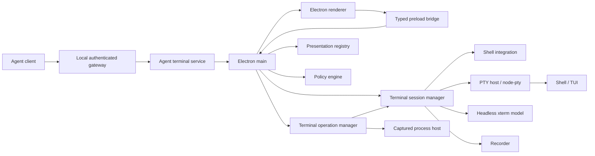
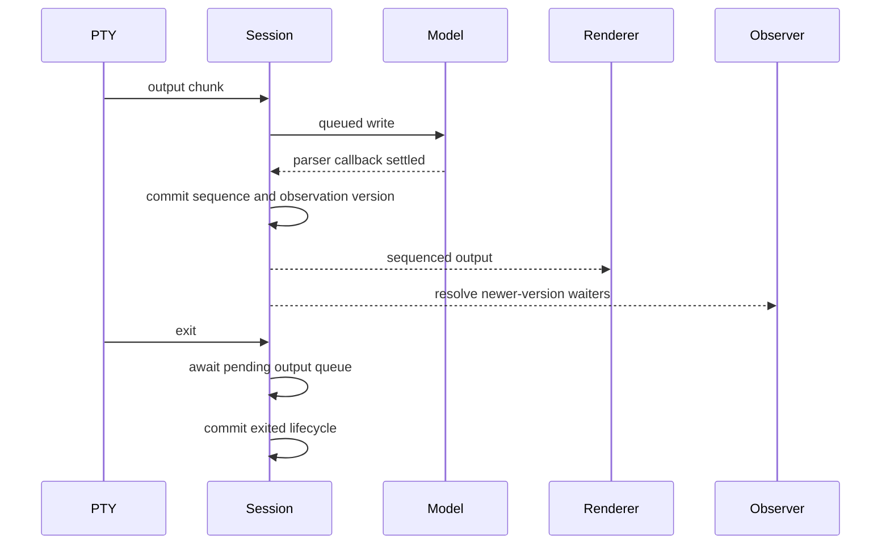

# Terminal Architecture Spec

## Status

Accepted architecture.

## Product Definition

ProContext Terminal is a standalone Electron terminal for humans and autonomous
coding agents. Every terminal session uses a real pseudoterminal. Humans and
agents operate the same PTY, canonical terminal emulator, and scrollable
viewport.

The complete agent contract is defined by
[Agent Terminal Interface Design](../agent-terminal-interface-design.md).

## Core Principles

- Electron main owns native processes, PTYs, windows, filesystem access, and
  policy enforcement.
- node-pty is the only PTY implementation boundary.
- Every PTY session owns one headless xterm.js model outside the renderer.
- Renderer xterm.js instances are projections, not canonical terminal state.
- PTY lifecycle, renderer presentation, and agent attachment are independent.
- Terminal input is one raw ordered byte-string operation.
- Versioned observation replaces snapshots, output replay, and specialized
  waiting operations.
- PTY bytes, terminal observations, recordings, audits, and app diagnostics
  remain separate.
- The renderer stays sandboxed and receives a narrow typed preload API.

## Process Architecture



## Ownership

### Protocol

Owns branded IDs, serializable domain types, Zod validation, renderer IPC
messages, agent transport messages, settings schemas, errors, and recording
schemas. It contains no process or UI logic.

### PTY host

Resolves and validates shells and wraps node-pty. It exposes spawn, input,
resize, termination, output, and exit without leaking node-pty types.

### Shell integration

Detects supported persistent shells, prepares best-effort startup hooks, parses
private nonce-authenticated OSC markers, and reduces trusted prompt, cwd, and
top-level command state. It does not own PTY lifecycle or terminal input.

### Session core

Owns session records, lifecycle, canonical terminal models, ordered processing,
observation versions and waiters, recording coordination, close, and shutdown.
It also owns one-shot operation records, bounded output journals, completion,
close, and retention. It imports neither Electron nor WebSocket.

### Electron main

Composes services, authorizes renderer actions, owns IPC, tracks renderer views,
and synchronizes canonical state with renderer projections.

### Renderer

Owns React UI, tabs, selection, focus, keyboard, paste, mouse, accessibility,
and visible xterm instances. It does not originate canonical title, cursor,
buffer, lifecycle, or observation state.

### Agent gateway

Owns loopback transport, authentication, fixed protocol-version validation,
exclusive agent attachment, policy checks, audit metadata, request dispatch,
and disconnect cleanup. It calls one narrow terminal service.

## Agent Contract Through Phase 4

```ts
type AgentTerminalCommand =
  | { type: "terminal.list"; payload: {} }
  | { type: "terminal.get"; payload: { sessionId: SessionId } }
  | { type: "terminal.run"; payload: RunTerminalRequest }
  | { type: "terminal.create"; payload: CreateTerminalRequest }
  | { type: "terminal.attach"; payload: { sessionId: SessionId } }
  | { type: "terminal.input"; payload: TerminalInputRequest }
  | { type: "terminal.resize"; payload: ResizeTerminalRequest }
  | { type: "terminal.scroll"; payload: ScrollTerminalRequest }
  | {
      type: "terminal.setPresentation";
      payload: SetTerminalPresentationRequest;
    }
  | {
      type: "terminal.observe";
      payload: ObserveTerminalRequest | ObserveCapturedOperationRequest;
    }
  | {
      type: "terminal.close";
      payload: { sessionId: SessionId } | { operationId: OperationId };
    }
  | { type: "terminal.recording.start"; payload: { sessionId: SessionId } }
  | { type: "terminal.recording.stop"; payload: { sessionId: SessionId } }
  | { type: "terminal.recording.export"; payload: { sessionId: SessionId } };
```

Transport is request/response. `terminal.observe` may remain pending until a
new observation version, lifecycle completion, cancellation, or timeout. There
is no independent agent PTY-output event stream.

`terminal.run({ tty: false })` owns a captured child process with separate
bounded stdout and stderr journals. `terminal.run({ tty: true })` owns a
temporary command PTY that reuses the canonical session model. Temporary and
persistent PTYs support headless, background, and foreground presentation
through correlated renderer commands. Renderer failure changes presentation
state without changing PTY lifecycle or agent attachment.

Persistent supported shells additionally expose trusted integration capability,
current cwd, prompt state, and top-level command lifecycle through session
summaries and canonical observations. Integration failure never changes PTY
lifecycle or raw shell behavior.

## Session Lifecycle

```ts
type TerminalLifecycleState =
  | "creating"
  | "running"
  | "exiting"
  | "exited"
  | "failed";
```

Presentation does not alter lifecycle. A session may be running with no
renderer view. Closing an active session requests termination and waits for a
bounded exit. Records are released only after exit and recording finalization.

## Canonical Output Flow



One parsed output chunk produces at most one observation version even when it
changes several visible fields.

## Renderer Bootstrap

When a view opens:

1. Subscribe to sequenced session output.
2. Request serialized canonical framebuffer state.
3. Receive the framebuffer and committed output sequence.
4. Restore the renderer xterm instance.
5. Apply buffered output whose sequence is newer than the bootstrap fence.
6. Register the renderer view in the presentation registry.

This sequence prevents output loss and duplication during view creation.

## Shared Viewport

The canonical model owns normal-buffer scroll position. Human scrolling reports
the settled position to main. Agent scrolling mutates the same position and
main instructs the renderer projection to follow it. Programmatic renderer
scroll updates are idempotent and must not echo indefinitely.

Input returns the viewport to the live bottom. Alternate-screen local scrolling
is unchanged; keys intended for the application remain terminal input.

## Security

- Agent transport binds loopback only by default.
- Descriptor and token files use restrictive permissions.
- Every untrusted boundary is runtime-validated.
- Every sensitive operation passes policy before side effects.
- One authenticated agent connection controls a session at a time.
- Humans retain concurrent control.
- Raw terminal input, PTY output, command lines, environment values, tokens,
  transcripts, and clipboard contents are not diagnostic logs or audit fields.

## Persistence

- Settings and recording formats remain versioned.
- Full transcripts persist only when recording is explicitly enabled.
- Session and operation runtime state is not restored after app restart in the
  foundation release.
- Default PTY scrollback is 5,000 rows.
- Captured operation streams default to 1 MiB each and may request up to
  16 MiB each.
- Temporary PTY result journals retain a fixed 1 MiB combined output tail.
- Completed captured and headless temporary PTY operations expire after
  10 minutes. Active operations never expire.

## Subsequent Phases

- Panes, search, links, settings UI, and release packaging improvements.

The subsequent-phase contracts are already fixed in the agent interface design
and must be implemented without reintroducing competing terminal state models.
