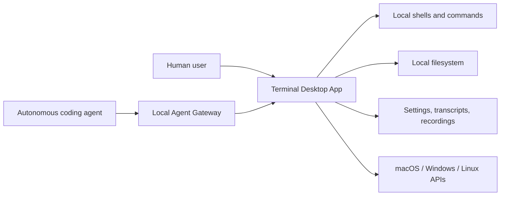
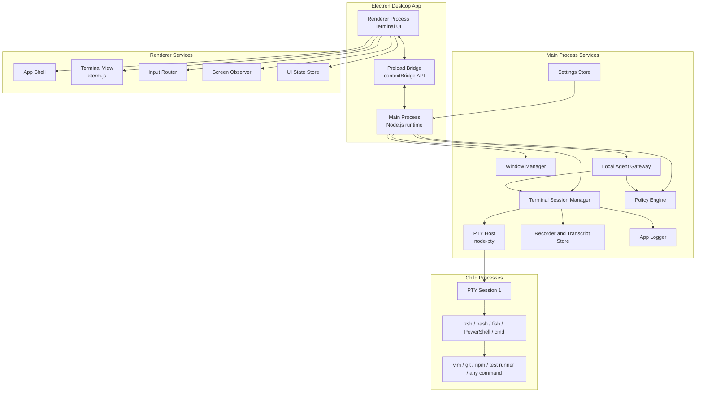
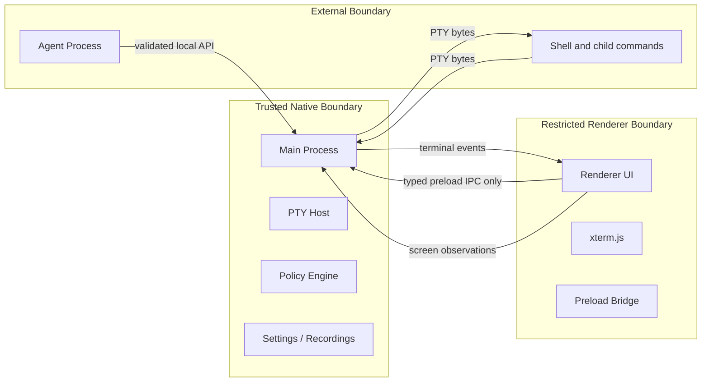
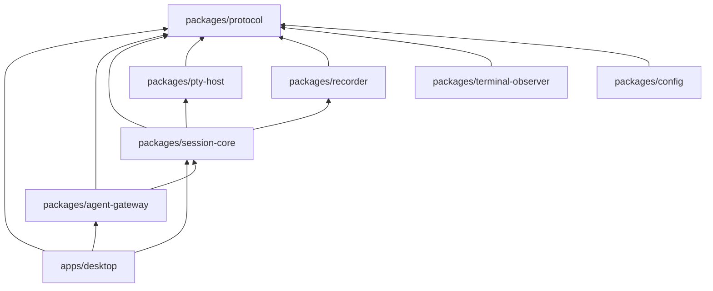
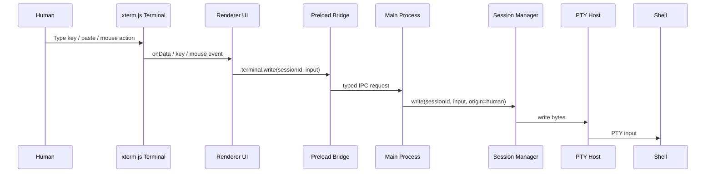
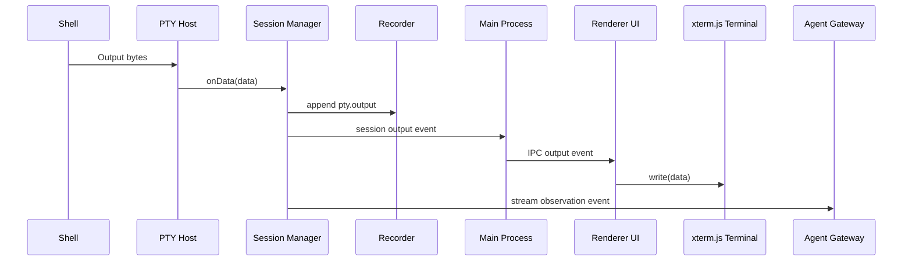
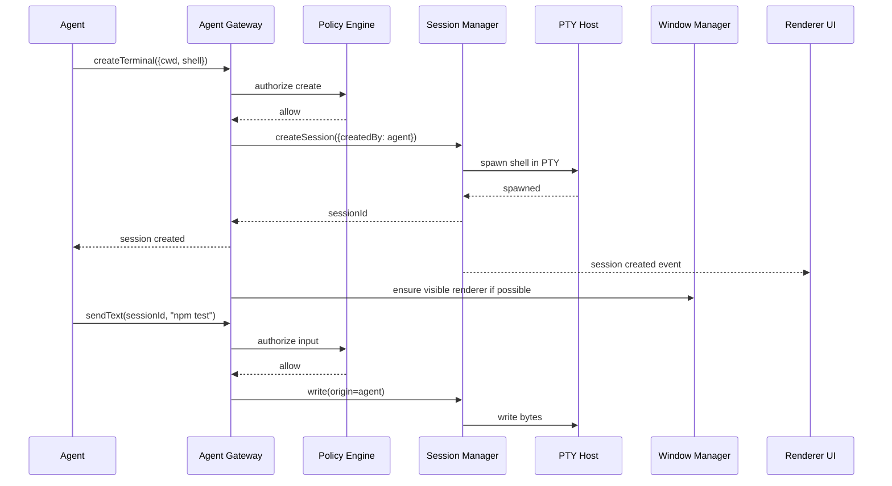
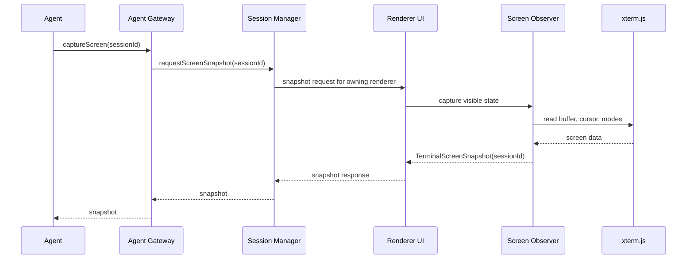
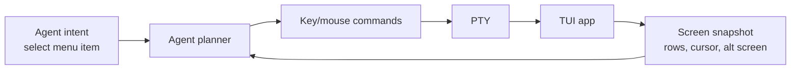
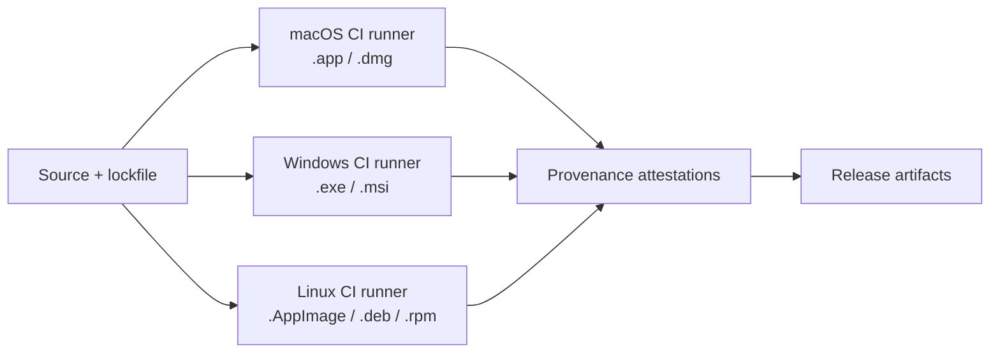

# Terminal Architecture Spec

## Status

Accepted baseline architecture.

## Purpose

This document is the master architecture entry point for the standalone desktop terminal. It defines the target system shape and links to the component specs that own detailed behavior.

Implementation can happen in phases, but the architecture in this document and the linked component specs are the intended end state.

## Product Definition

The product is a desktop terminal application with a real local pseudoterminal behind every terminal session. Humans interact through a terminal UI. Agents interact through a structured control API. Both humans and agents operate the same terminal session, so commands, prompts, TUIs, resize behavior, process lifecycle, and terminal output remain faithful to a real terminal.

The app is not a shell, not a fake command runner, and not an IDE. It is a terminal host with agent-native control and observation.

## Primary Goals

- Run real shells and interactive programs through a PTY.
- Provide a fast, polished terminal UI for humans.
- Let agents create terminal windows, send text, send keys, resize sessions, and terminate sessions.
- Let agents inspect recent output, visible viewport state, cursor position, alternate-screen state, and transcript history.
- Support TUIs by preserving normal terminal behavior: alternate screen, ANSI sequences, mouse events, raw keyboard input, and resize events.
- Keep native capabilities in the Electron main process and expose them through narrow typed APIs.
- Keep terminal bytes, app logs, agent observations, and recordings separate.
- Package the same TypeScript codebase as native desktop apps for macOS, Windows, and Linux.

## Non-goals

- The app does not replace the user's shell.
- The app does not build a full IDE.
- The app does not parse every TUI semantically. It provides faithful screen state and interaction primitives that agents can use.
- The app does not expose unauthenticated remote terminal control.
- The renderer does not get unrestricted Node.js access.

## Stack Decision

| Layer | Technology | Responsibility |
| --- | --- | --- |
| Language | TypeScript | Application code, protocol types, tests, shared packages |
| Desktop runtime | Electron | Native desktop app, main/renderer process model, packaging |
| Terminal renderer | xterm.js | ANSI terminal rendering, input capture, scrollback, alternate screen, mouse support |
| PTY backend | node-pty | Real pseudoterminals on macOS, Linux, and Windows ConPTY |
| UI framework | React | App shell, tabs, panes, settings, session UI |
| Internal contracts | Shared TypeScript protocol package | Typed IPC, agent API, domain events, error types |
| Runtime validation | Zod | Validate IPC, config, persisted state, and external agent messages |
| Unit/integration tests | Vitest | Protocol, session manager, key encoding, recorder, policy |
| UI/e2e tests | Playwright Electron harness | Human terminal behavior, resize, copy/paste, app workflows |
| Packaging | electron-builder | macOS, Windows, and Linux distributables |

Electron is selected because the architecture needs Chromium UI, native process access, Node-compatible native modules, mature cross-platform packaging, and a path similar to VS Code's terminal model. Tauri is not part of this baseline architecture.

## Component Specs

Each component has its own spec. These documents own detailed responsibilities, boundaries, contracts, and test expectations.

| Component | Spec |
| --- | --- |
| Electron main process | [Electron Main Process](./components/electron-main-process.md) |
| Window manager | [Window Manager](./components/window-manager.md) |
| Preload bridge | [Preload Bridge](./components/preload-bridge.md) |
| Renderer app shell | [Renderer App Shell](./components/renderer-app-shell.md) |
| Terminal view | [Terminal View](./components/terminal-view.md) |
| Input router | [Input Router](./components/input-router.md) |
| Terminal session manager | [Terminal Session Manager](./components/terminal-session-manager.md) |
| PTY host | [PTY Host](./components/pty-host.md) |
| Shell resolver | [Shell Resolver](./components/shell-resolver.md) |
| Agent gateway | [Agent Gateway](./components/agent-gateway.md) |
| Policy engine | [Policy Engine](./components/policy-engine.md) |
| Screen observer | [Screen Observer](./components/screen-observer.md) |
| Recorder and transcript store | [Recorder and Transcript Store](./components/recorder-transcript-store.md) |
| Settings store | [Settings Store](./components/settings-store.md) |
| App logger | [App Logger](./components/app-logger.md) |

## Implementation Plan

The phased build sequence, test layers, coverage requirements, and release verification checks are defined in the [Implementation and Testing Plan](./implementation-plan.md).

## System Context



The desktop app is the trust boundary. It owns all local terminal sessions.
Agents do not spawn shells directly through the UI; they request terminal
operations through the local agent gateway, which applies validation, policy,
audit logging, and session ownership rules. Renderer IPC is also treated as
untrusted input at the main-process boundary, so sensitive human actions such
as recording control are authorized before recorder side effects occur.

## Process Architecture



## Trust Boundaries



Main-process services are trusted with native OS access. Renderer code is restricted and talks to the main process only through the preload bridge. Agent processes are external callers and must be authenticated, authorized, validated, and audited. Shell processes are untrusted workloads because they can emit arbitrary terminal sequences.

## Package Layout

The repo should use a TypeScript workspace.

```text
apps/
  desktop/
    src/main/          Electron main process
    src/preload/       preload bridge
    src/renderer/      UI app and xterm.js integration
packages/
  protocol/            shared IPC, agent API, event, error, and schema types
  pty-host/            node-pty adapter and shell resolver
  session-core/        session manager, lifecycle, recorder integration
  agent-gateway/       local WebSocket/socket server and request handling
  recorder/            transcript and replay event storage
  terminal-observer/   screen snapshot helpers and wait conditions
  config/              settings schema, migrations, platform app paths
  test-fixtures/       deterministic shell scripts and PTY fixtures
docs/
  specs/
    terminal-architecture.md
    components/
      README.md
```

Dependency direction:



Shared packages must not import app-specific renderer or Electron window code.
In the Phase 2 implementation, xterm screen snapshot helpers live in
`apps/desktop/src/renderer/screen-observer.ts` because they are tightly coupled
to renderer-owned xterm buffer state. Move them to `packages/terminal-observer`
only if they grow into renderer-independent observation logic.

## Core Data Flow

### Human Input to Shell



### Shell Output to Human and Agent



### Agent Creates and Operates a Terminal



Renderer display is best effort for agent-created sessions. If no renderer
window can be created, the PTY session remains available through the agent API
in detached/headless mode and renderer-dependent observations report structured
observation errors instead of failing the create operation.
Destroyed or crashed renderer web contents do not count as available display
surfaces. If a renderer that owns live sessions is destroyed or its render
process is lost, main detaches orphaned sessions so a replacement renderer can
rediscover and reattach them.

### Viewport Snapshot



If no renderer owns the requested session, the snapshot request fails
immediately with `observation_unavailable`. Main validates snapshot responses
against the pending request ID and session ID before resolving the agent-facing
operation.

## IPC Contract

IPC messages must be named, typed, versioned, and validated.

Renderer to main commands:

```ts
type RendererCommand =
  | { type: "session.create"; requestId: RequestId; payload: CreateSessionRequest }
  | { type: "session.write"; requestId: RequestId; payload: WriteInputRequest }
  | { type: "session.resize"; requestId: RequestId; payload: ResizeSessionRequest }
  | { type: "session.kill"; requestId: RequestId; payload: KillSessionRequest }
  | { type: "session.get"; requestId: RequestId; payload: GetSessionRequest }
  | { type: "session.setTitle"; requestId: RequestId; payload: { sessionId: SessionId; title: string } }
  | { type: "session.bell"; requestId: RequestId; payload: { sessionId: SessionId } }
  | { type: "settings.get"; requestId: RequestId; payload: {} }
  | { type: "session.snapshot.response"; requestId: RequestId; payload: TerminalScreenSnapshot };
```

Main to renderer events:

```ts
type RendererEvent =
  | { type: "session.created"; payload: TerminalSessionSnapshot }
  | { type: "session.output"; payload: { sessionId: SessionId; data: string } }
  | { type: "session.title"; payload: { sessionId: SessionId; title: string } }
  | { type: "session.bell"; payload: { sessionId: SessionId } }
  | { type: "session.exited"; payload: SessionExitEvent }
  | { type: "session.error"; payload: TerminalError }
  | { type: "session.snapshot.request"; requestId: RequestId; payload: { sessionId: SessionId } };
```

Rules:

- No raw `ipcRenderer` is exposed to renderer application code.
- Every request carries a request ID.
- Every response uses a typed result envelope: `{ ok: true, requestId, value }` or `{ ok: false, requestId, error }`.
- The preload bridge unwraps result envelopes into the renderer API and rejects failed calls with typed terminal errors.
- Long-lived streams use explicit subscribe/unsubscribe operations.
- Payloads are runtime-validated at process boundaries.
- `session.error` is a diagnostic event and does not inherently mark a session failed; lifecycle state comes from snapshots and lifecycle events.

## Agent Control Contract

Agent requests should mirror session-manager operations while adding authorization, audit, and synchronization.

```ts
type AgentCommand =
  | { type: "agent.authenticate"; requestId: RequestId; payload: { token: string } }
  | { type: "terminal.list"; requestId: RequestId; payload: {} }
  | { type: "terminal.create"; requestId: RequestId; payload: CreateTerminalPayload }
  | { type: "terminal.attach"; requestId: RequestId; payload: { sessionId: SessionId } }
  | { type: "terminal.sendText"; requestId: RequestId; payload: { sessionId: SessionId; text: string } }
  | { type: "terminal.sendKey"; requestId: RequestId; payload: { sessionId: SessionId; key: TerminalKey } }
  | { type: "terminal.paste"; requestId: RequestId; payload: { sessionId: SessionId; text: string } }
  | { type: "terminal.sendMouse"; requestId: RequestId; payload: { sessionId: SessionId; data: string } }
  | { type: "terminal.interrupt"; requestId: RequestId; payload: { sessionId: SessionId } }
  | { type: "terminal.resize"; requestId: RequestId; payload: { sessionId: SessionId; cols: number; rows: number } }
  | { type: "terminal.captureScreen"; requestId: RequestId; payload: CaptureScreenPayload }
  | { type: "terminal.readRecentOutput"; requestId: RequestId; payload: { sessionId: SessionId; maxBytes: number } }
  | { type: "terminal.waitForText"; requestId: RequestId; payload: WaitForTextPayload }
  | { type: "terminal.waitForQuiet"; requestId: RequestId; payload: WaitForQuietPayload }
  | { type: "terminal.waitForScreenChange"; requestId: RequestId; payload: WaitForScreenChangePayload }
  | { type: "terminal.waitForPrompt"; requestId: RequestId; payload: WaitForPromptPayload }
  | { type: "terminal.kill"; requestId: RequestId; payload: { sessionId: SessionId } }
  | { type: "terminal.release"; requestId: RequestId; payload: { sessionId: SessionId } }
  | { type: "terminal.startRecording"; requestId: RequestId; payload: { sessionId: SessionId } }
  | { type: "terminal.stopRecording"; requestId: RequestId; payload: { sessionId: SessionId } }
  | { type: "terminal.exportRecording"; requestId: RequestId; payload: { sessionId: SessionId } };
```

Agent events:

```ts
type AgentEvent =
  | { type: "terminal.created"; payload: TerminalSessionSnapshot }
  | { type: "terminal.output"; payload: { sessionId: SessionId; data: string } }
  | { type: "terminal.screenChanged"; payload: { sessionId: SessionId; capturedAt: string } }
  | { type: "terminal.exited"; payload: SessionExitEvent }
  | { type: "terminal.denied"; payload: PolicyDenial }
  | { type: "terminal.error"; payload: TerminalError };
```

The agent API is not a generic remote shell protocol. It is a terminal-control protocol with terminal-specific operations and observations.

## Terminal and TUI Behavior

The architecture supports TUIs by preserving terminal semantics rather than bypassing them.

Required behaviors:

- PTY sessions must use real terminal dimensions.
- Renderer resize must update both xterm.js and node-pty.
- Alternate-screen applications must render correctly.
- Mouse reporting must be forwarded when terminal modes request it.
- Raw key combinations must map to the expected terminal escape sequences.
- `Ctrl+C`, `Ctrl+D`, `Ctrl+Z`, arrows, function keys, page keys, and escape must be encoded consistently.
- Screen snapshots must work for both normal buffer and alternate buffer.
- Scrollback observations must distinguish visible viewport from historical output.

TUI operation model:



The app provides faithful observation and input primitives. The agent remains responsible for choosing actions.

## Platform Behavior

### macOS

- Default shell usually comes from the user's login shell.
- PTY backend uses Unix PTY behavior through node-pty.
- Packaged output should include `.app` and `.dmg`.
- App data should use Electron app paths.

### Linux

- Default shell usually comes from environment/user account configuration.
- PTY backend uses Unix PTY behavior through node-pty.
- Packaged output should include AppImage and optionally `.deb` and `.rpm`.
- Headless CI tests should run with a virtual display where needed.

### Windows

- Default shell should support PowerShell first, with cmd and WSL profiles configurable.
- PTY backend uses Windows ConPTY through node-pty.
- Path, newline, shell args, and environment handling must be platform-aware.
- Packaged output should include installer artifacts such as `.exe` or `.msi`.

## Persistence

Persisted data:

- App settings.
- Shell profiles.
- Agent gateway settings.
- Policy settings.
- Session recordings.
- Transcript indexes.
- Window state.

Do not persist by default:

- Secrets from terminal output.
- Full transcripts unless recording is enabled.
- Agent tokens after expiry.

All persisted formats must include schema versions and migrations.

## Security Architecture

Security requirements:

- Renderer uses context isolation.
- Renderer does not get broad Node.js access.
- Preload exposes only the typed terminal API.
- External agent gateway binds to local-only transports by default.
- Agent connections require short-lived authentication.
- Agent operations, including authentication, are authorized by the policy engine.
- Renderer-triggered recording start, stop, and export operations are
  authorized by the policy engine as local human actions before transcript
  recorder side effects.
- Policy requests include safe metadata such as cwd, shell, session ID, and coarse operation kind, but exclude raw terminal input and PTY output by default.
- All agent operations are auditable.
- Main-process policy decisions for renderer sensitive actions are logged with
  safe metadata only: request ID, session ID, origin, decision ID, outcome, and
  denial code.
- Runtime validation is required for IPC, agent messages, settings, and recordings.
- Shell output is treated as untrusted text containing control sequences.
- Clipboard operations require clear origin handling.
- Recording can be disabled, redacted, or scoped by policy.
- Recording persistence is versioned append-only JSONL; export keeps the protocol schema version 1 envelope.

Sensitive operations:

- Creating terminals in protected directories.
- Sending input from agents.
- Sending paste blocks from agents.
- Enabling recording.
- Exporting transcripts.
- Enabling external agent gateway access.
- Killing sessions not owned by the caller.

Each sensitive operation should have a policy decision point even if the first implementation permits it under local development settings.

## Observability

Observability has three separate outputs:

1. App logs for debugging the application.
2. Terminal transcripts for replaying PTY sessions.
3. Agent observations for real-time decision-making.

These outputs must not be mixed.

Phase 1 app diagnostics use structured JSON Lines. The Electron main process
writes `main.log` under Electron's `app.getPath("logs")` directory, mirrors logs
to stderr in development, rotates the file at 5 MB, and keeps 3 rotated files.
Default level is `debug` in development and `info` when packaged, with
`PROCONTEXT_LOG_LEVEL` available for local overrides.

Recommended app log fields:

- timestamp
- level
- component
- event
- sessionId when relevant
- requestId when relevant
- origin: human, agent, system
- error type and cause when relevant

Log context is redacted for sensitive fields such as credentials, cookies,
environment values, keys, passwords, secrets, and tokens. Terminal output,
terminal input, clipboard contents, transcript data, and full environment values
must not be logged as app diagnostics by default.

## Packaging and Release Architecture

Builds should happen on each target OS because Electron and native PTY dependencies have platform-specific artifacts.



Release verification checks are defined in the [Implementation and Testing Plan](./implementation-plan.md).

## Key Design Decisions

1. **Use a real PTY for every terminal session.** This is required for shells and TUIs to behave correctly.
2. **Keep node-pty in the main process.** Native process control belongs behind the trusted boundary.
3. **Use xterm.js only for rendering and terminal UI behavior.** It is not the shell and does not own process lifecycle.
4. **Use typed protocol packages for IPC and agent control.** Process boundaries must be explicit contracts.
5. **Make agent control a first-class API.** It should not be implemented through test hooks or DOM automation.
6. **Separate human UI state from terminal session state.** The main process owns canonical session lifecycle.
7. **Separate PTY bytes, app logs, agent observations, and recordings.** Mixing these channels creates security and debugging problems.
8. **Treat all external inputs as untrusted.** This includes agent messages, settings files, recordings, and shell output.
9. **Build on one TypeScript codebase but package per OS.** Native PTY dependencies require platform-aware CI.

## References

- Electron process model and preload bridge: https://www.electronjs.org/docs/latest/tutorial/process-model
- xterm.js documentation: https://xtermjs.org/docs
- xterm.js project overview: https://github.com/xtermjs/xterm.js
- node-pty project overview: https://github.com/microsoft/node-pty
